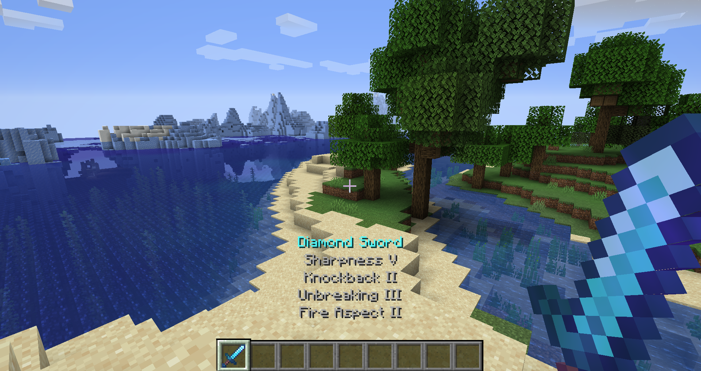

### Helpful Held Tooltips

Helpful Held Tooltips is a Fabric mod which adds in the item tooltips from bedrock:

It currently only applies to enchantments.

#### License

Helpful Held Tooltips is available under the MIT license. 

#### Creation Video

If you're interested in watching a video where I showcase how I created this mod, you can check out [this video](https://www.youtube.com/watch?v=QyaRTqUbDbs&feature=youtu.be) on my YouTube channel.
